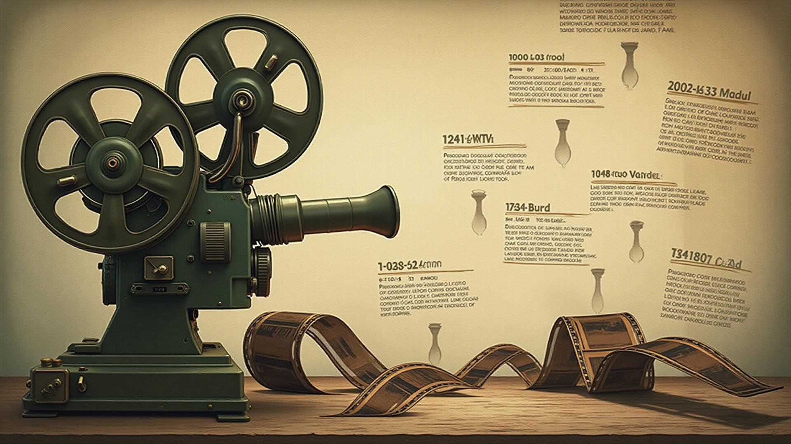

# WWII Timeline - Cinema e História

Uma aplicação web interativa que explora a Segunda Guerra Mundial através da perspectiva cinematográfica, conectando filmes e séries aos eventos históricos de 1939-1945.



## 📋 Sobre o Projeto

O **WWII Timeline** é uma timeline interativa que combina história e cinema, permitindo aos usuários explorarem os momentos mais marcantes da Segunda Guerra Mundial e descobrirem como esses eventos foram retratados no cinema e na televisão.

### ✨ Funcionalidades

- **Timeline Interativa**: Navegue pelos anos de 1939-1945 com uma interface intuitiva
- **Conexão Cinema & História**: Descubra filmes e séries relacionados a cada evento histórico
- **Interface Responsiva**: Experiência otimizada para desktop e dispositivos móveis
- **Navegação Horizontal**: Timeline horizontal para melhor visualização dos eventos
- **Design Temático**: Interface inspirada na estética da época com cores militares

### 📊 Estatísticas

- **100+** filmes mapeados
- **6 anos** de história detalhada
- **50+** eventos históricos catalogados

## 🚀 Tecnologias Utilizadas

- **Frontend**: React 18 + TypeScript
- **Build Tool**: Vite
- **Styling**: Tailwind CSS
- **UI Components**: shadcn/ui + Radix UI
- **Roteamento**: React Router DOM
- **Ícones**: Lucide React
- **Gerenciamento de Estado**: TanStack Query

## 🛠️ Instalação e Configuração

### Pré-requisitos

- Node.js (versão 18 ou superior)
- npm ou yarn

### Passos para instalação

1. **Clone o repositório**
   ```bash
   git clone <URL_DO_REPOSITORIO>
   cd wwii-timeline
   ```

2. **Instale as dependências**
   ```bash
   npm install
   ```

3. **Inicie o servidor de desenvolvimento**
   ```bash
   npm run dev
   ```

4. **Abra o navegador**
   Acesse `http://localhost:5173`

### Scripts disponíveis

```bash
# Desenvolvimento
npm run dev

# Build de produção
npm run build

# Build de desenvolvimento
npm run build:dev

# Lint
npm run lint

# Preview da build
npm run preview
```

## 📁 Estrutura do Projeto

```
wwii-timeline/
├── public/
│   ├── favicon.ico
│   ├── placeholder.svg
│   └── robots.txt
├── src/
│   ├── assets/
│   │   └── hero-background.jpg
│   ├── components/
│   │   └── ui/                 # Componentes UI (shadcn/ui)
│   ├── data/
│   │   └── sampleEvents.ts     # Dados dos eventos WWII
│   ├── hooks/
│   │   ├── use-mobile.tsx
│   │   └── use-toast.ts
│   ├── lib/
│   │   └── utils.ts
│   ├── pages/
│   │   ├── Index.tsx           # Página inicial
│   │   ├── Timeline.tsx        # Página da timeline
│   │   └── NotFound.tsx        # Página 404
│   ├── App.tsx
│   ├── index.css
│   └── main.tsx
├── components.json
├── package.json
├── tailwind.config.ts
├── tsconfig.json
└── vite.config.ts
```

## 🎨 Componentes Principais

### Timeline
Componente principal que renderiza os eventos históricos de forma interativa.

### HorizontalTimeline
Versão horizontal da timeline para melhor navegação temporal.

### Card & UI Components
Conjunto completo de componentes UI baseados no shadcn/ui para interface consistente.

## 📚 Dados e Conteúdo

Os eventos históricos estão catalogados em `src/data/sampleEvents.ts`, incluindo:
- Datas importantes
- Descrições detalhadas
- Filmes e séries relacionados
- Contexto histórico

## 🎯 Funcionalidades Futuras

- [ ] Sistema de favoritos para filmes
- [ ] Filtros por país/teatro de operações
- [ ] Integração com APIs de filmes
- [ ] Sistema de comentários e avaliações
- [ ] Modo escuro/claro
- [ ] Exportação de timeline personalizada

## 🤝 Contribuição

1. Faça um fork do projeto
2. Crie uma branch para sua feature (`git checkout -b feature/AmazingFeature`)
3. Commit suas mudanças (`git commit -m 'Add some AmazingFeature'`)
4. Push para a branch (`git push origin feature/AmazingFeature`)
5. Abra um Pull Request

## 📄 Licença

Este projeto está sob a licença MIT. Veja o arquivo `LICENSE` para mais detalhes.

## 👨‍💻 Autor

Desenvolvido com ❤️ por [Seu Nome]

---

**WWII Timeline** - Conectando história e cinema para uma experiência educativa única.